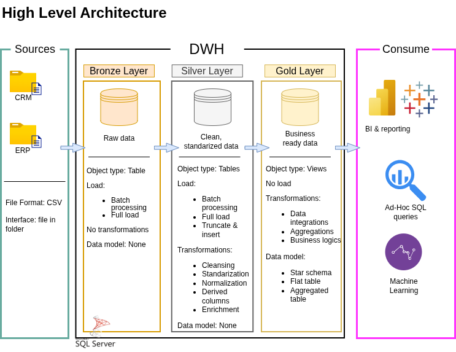

# SQL Data Warehouse Project

A end-to-end data warehousing solution built with SQL Server, covering ingestion, transformation, and analytical reporting across a retail sales domain.

---

## 🏛️ Architecture Overview

This project is structured around the **Medallion Architecture**, organizing data across three distinct layers:



| Layer | Purpose |
|-------|---------|
| **Bronze** | Raw data landed directly from source CSV files, no transformations applied. |
| **Silver** | Cleansed, standardized, and normalized data ready for integration. |
| **Gold** | Business-ready (Star schema) tables optimized for reporting and analytics. |

---

## 📋 What's Inside

This project walks through the full lifecycle of a data warehouse build:

- **Ingestion**: Loading raw CSV data from ERP and CRM source systems into the Bronze layer
- **Transformation**: Cleaning, deduplicating, and standardizing data in the Silver layer
- **Modeling**: Building fact and dimension tables in the Gold layer using a star schema
- **Analytics**: Writing SQL queries to surface insights around sales performance, customer behavior, and product trends

---

## 🛠️ Tech Stack

| Tool | Role |
|------|------|
| SQL Server Express | Database engine |
| Visual Studio Code | Query development and script editing |
| T-SQL | ETL scripting and analytics |
| Draw.io | Architecture and data flow diagrams |
| Git / GitHub | Version control |

---

## 📂 Repository Structure

```
sql-data-warehouse-project/
│
├── datasets/                    # Source CSV files (ERP and CRM data)
│
├── docs/                        # Architecture diagrams and documentation
│   ├── data architecture        
│   ├── data models              
│   ├── data catalogue           # Field-level descriptions for all tables
│   └── naming conventions       # Standards for table and column naming
│
├── scripts/                     # All SQL scripts, organized by layer
│   ├── bronze/                  # Raw data loading scripts
│   ├── silver/                  # Cleansing and transformation scripts
│   └── gold/                    # Star schema and analytical model scripts
│   └── analysis/                # Data analysis scripts
│
├── tests/                       # Data quality checks and validation scripts
│
├── README.md
├── LICENSE
└── .gitignore
```

---

## 🎯 Project Scope

### Data Engineering

**Goal:** Build a consolidated data warehouse from two source systems that enables reliable analytical reporting.

**Key requirements:**
- Ingest data from ERP and CRM systems (provided as CSV files)
- Identify and resolve data quality issues during the Silver layer transformation
- Produce an integrated, query-optimized data model in the Gold layer
- Focus on current-state data (no historization required)
- Document all models clearly for both technical and business audiences

### Analytics & Reporting

**Goal:** Deliver SQL-based insights across three core areas:

- **Sales Trends**: Period-over-period performance, revenue patterns
- **Customer Behavior**: Segmentation, purchase frequency, lifetime value
- **Product Performance**: Top/bottom performers, category breakdowns

---

## ⚙️ Getting Started

### Prerequisites

- [SQL Server Express](https://www.microsoft.com/en-us/sql-server/sql-server-downloads) — free edition, sufficient for this project
- [Visual Studio Code](https://code.visualstudio.com/) with the [SQL Server (mssql) extension](https://marketplace.visualstudio.com/items?itemName=ms-mssql.mssql) — for writing and executing scripts

### Setup Steps

1. Clone this repository
   ```bash
   git clone https://github.com/YOUR_USERNAME/sql-data-warehouse-project.git
   ```

2. Open SSMS and connect to your local SQL Server instance

3. Run the database initialization script:
   ```
   scripts/init_database.sql
   ```

4. Execute scripts in layer order:
   - `scripts/bronze/` — load raw source data
   - `scripts/silver/` — apply transformations
   - `scripts/gold/` — build the analytical model

5. Explore the analytics queries in `scripts/gold/` to validate the output

---

## 📊 Data Model

The Gold layer follows a **star schema** design:

- **Fact table:** `fact_sales` (one row per sales transaction).
- **Dimension tables:** `dim_customers`, `dim_products`

Refer to `docs/DataIntegrationModel_TMR.png` for the full ERD and `docs/data_catalog.md` for field-level documentation.

---

## 📌 Skills Demonstrated

This project is intended to showcase practical competency in:

- Data warehouse design and Medallion Architecture
- ETL pipeline development with T-SQL
- Dimensional modeling (star schema)
- Data quality assessment and cleansing
- SQL-based analytics and reporting

---

## 📝 Acknowledgements

This project was built following the tutorial by [Baraa Khatib Salkini (Data With Baraa)](https://github.com/DataWithBaraa/sql-data-warehouse-project). The architecture, datasets, and overall approach are based on his original work. My version includes personal modifications to the transformation logic, query structure, and documentation.

---

## 🪪 About Me

I'm **Tatiana M. Rodriguez**, a data professional with a Ph.D. in Physics and a knack for bringing order to chaos. I'm transitioning from academia into data engineering, where I can apply the same analytical rigor to problems that drive real business decisions. 

Let's stay in touch! Feel free to connect with me on the following platforms:

[](https://linkedin.com/in/tmrodriguez-work)
[](www.tmrodriguez.com) 
[](mailto:tatianamrodriguez.contact@gmail.com)

---

## 🛡️ License

This project is licensed under the [MIT License](LICENSE).
